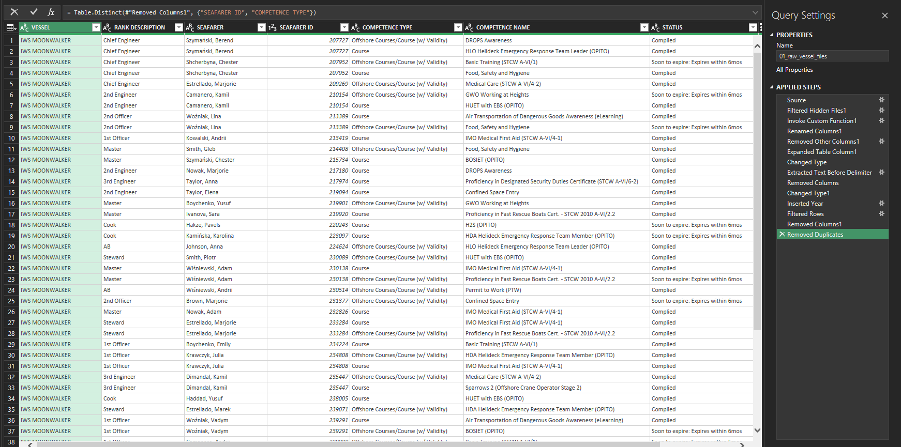
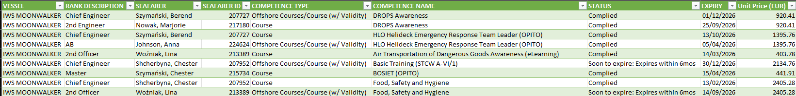

**Fleet Training Budget Forecast (Excel + Power Query)**
**Project Overview**

This project demonstrates an end-to-end Excel BI workflow for forecasting mandatory training costs across a fleet of offshore vessels.
Using **Power Query**, multiple vessel-level training matrices are consolidated, cleaned, deduplicated, and enriched with pricing data to produce a budget-ready dataset and management summaries.

All data used in this project is **fully synthetic** and created for portfolio purposes only.

**Business Problem**

Training coordinators and fleet managers need to:

⦁	Consolidate training records from multiple vessels

⦁	Identify certifications expiring in a given year

⦁	Avoid double-counting crew members working across vessels

⦁	Estimate upcoming training costs

⦁	Understand budget drivers by vessel and course type

This project simulates that real-world scenario.

**Data Sources**

⦁	**6 vessel training matrices** (Excel files, one per vessel)

⦁	**Course price list** (Excel lookup table)

Each vessel file contains:

⦁	Seafarer details

⦁	Rank

⦁	Competence name and type

⦁	Status

⦁	Expiry date

**Power Query Transformation Pipeline**

The following steps were implemented in Power Query:

1.	**Folder-based ingestion** of multiple Excel files

2.	**Schema standardization** using a sample file

3.	**Text extraction** to derive Vessel name from file names

4.	**Data type normalization** (dates, currency)

5.	**Filtering** to include only certificates expiring in 2026

6.	**Deduplication** by Seafarer ID + Competence Name
(prevents double-counting across vessels)

7.	**Merge with price list** (left join on Competence Name)

8.	**Final fact table load** for reporting and analysis

**Final Dataset (Fact Table)**

The resulting fact table contains:

⦁	Vessel

⦁	Rank Description

⦁	Seafarer

⦁	Seafarer ID

⦁	Competence Type

⦁	Competence Name

⦁	Status

⦁	Expiry Date

⦁	Unit Price (EUR)

This structure is optimized for PivotTables and Power BI.

**Reporting Outputs**

Pivot tables were created to support decision-making:

⦁	**Total training budget by vessel**

⦁	**Total training budget by competence**

⦁	**Headcount requiring training per competence**

⦁	Interactive slicers (Vessel, Status, Competence Type)

**Tools Used**

⦁	Microsoft Excel (Desktop)

⦁	Power Query

⦁	Pivot Tables

⦁	Folder-based ETL pattern

**How to Run the Project**

1.	Download or clone the repository

2.	Open _IWS_Fleet_Budget_Portfolio.xlsx_

3.	Ensure raw files remain in _01_raw_vessel_files_

4.	Go to **Data → Refresh All**

5.	Review the updated fact table and pivot summaries

**Screenshots**

### Power Query transformation steps

### After merging with Price List

### Final fact table

### Pivot summary dashboard

**Disclaimer**

All names, vessels, prices, and records are fictional and created solely for demonstration and portfolio purposes.
